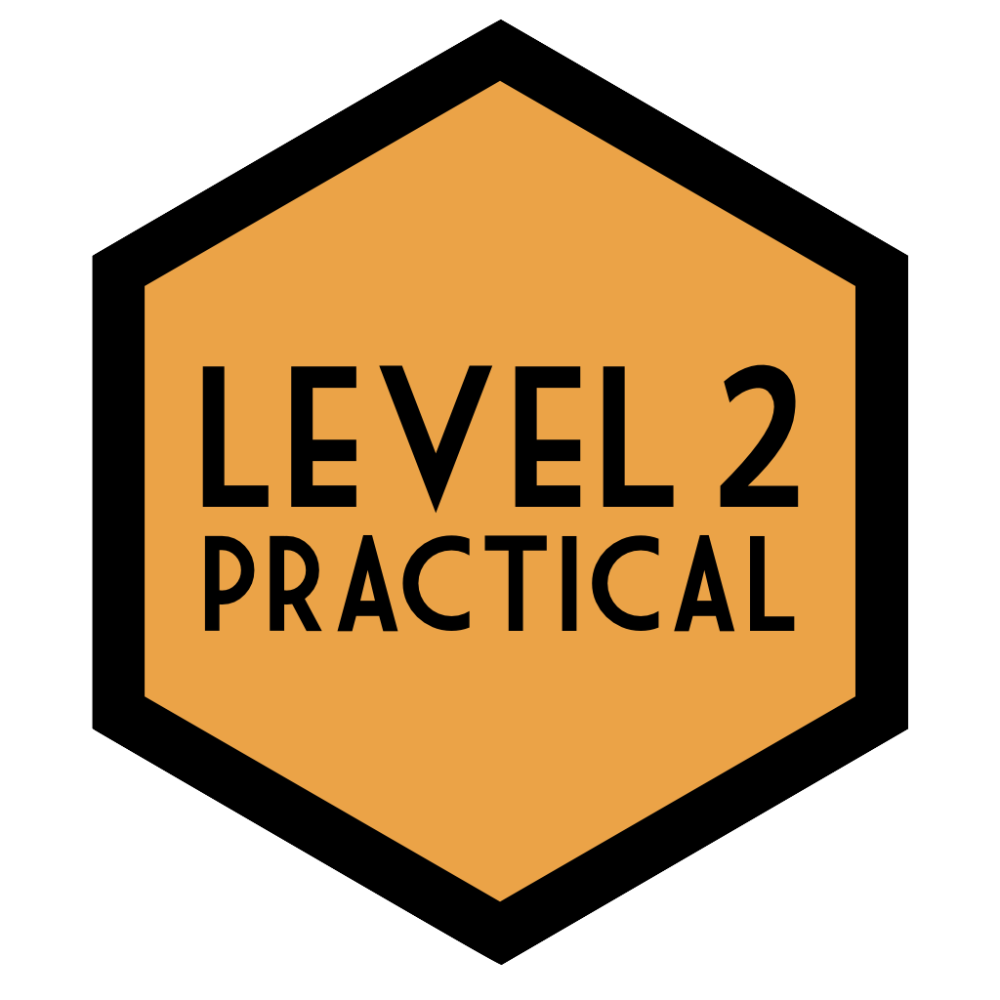
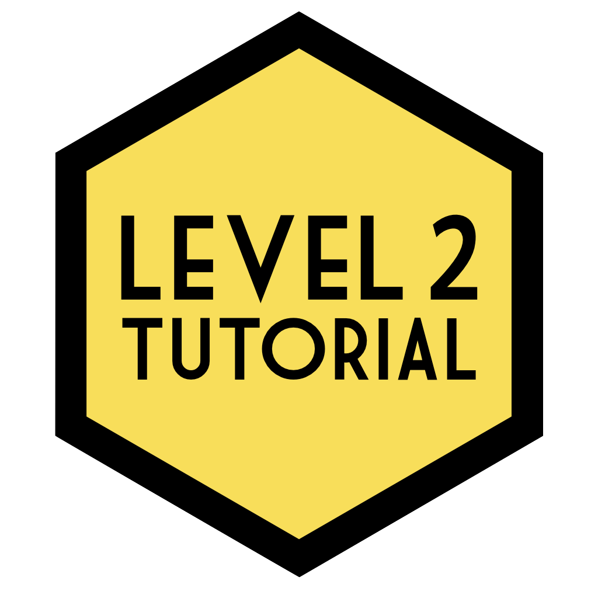

 [Overview](/ug-overview/) 

 [Level 1 Practical](/ug1-practical/)

 [Level 2 Practical](/ug2-practical/)

 [Level 2 Tutorial](/ug2-tutorial/)

 [Level 3 Stats](/ug3-stats/)

 [MSc Conversion](/msc-conv-f2f/)

 [MSc Data Skills](/msc-data-skills/)

 [Glossary of Terms](/glossary/)

 [Book Template](/book-template/)
