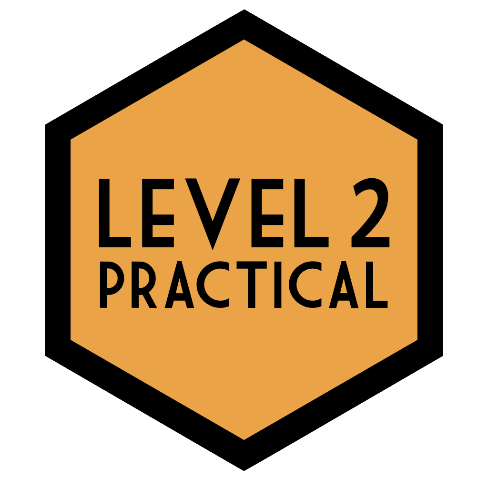

 

### [Level 1: Grassroots](https://psyteachr.github.io/ug1-practical/)

Our first-year undergraduate course covers current state of psychological science and what Open Science is as well as its importance. It also aims to make students confident and competent at using RStudio as a tool to achieve good data management skills.

 

### [Level 2: Practical](https://philmcaleer.github.io/ug2-practical/)

Our second-year undergraduate course covers data skills such as R Markdown, data wrangling with tidyverse, and data visualisation with ggplot2. It also introduces statistical concepts such as permutation tests, NHST, alpha, power, effect size, and sample size. Semester 2 focusses on correlations and the general linear model.

 

### Level 3: Statistical Models (Coming Soon)

This third-year undergraduate course teaches students how to specify, estimate, and interpret statistical models corresponding to various study designs, using a General Linear Models approach.

 <a class="logo" href="/msc-conv-f2f/"> 

### [MSc Conversion](/msc-conv-f2f/)

This book contains materials for students on the MSc Conversion in Psychological Studies/Science, a one-year postgraduate degree for students with a non-psychology undergraduate degree. This research methods course covers core data skills that allow you to manipulate and analyse quantitative data.

 

### [MSc Data Skills](/msc-data-skills/)

This course provides an overview of skills needed for reproducible research and open science using the statistical programming language R. Students will learn about data visualisation, data tidying and wrangling, archiving, iteration and functions, probability and data simulations, general linear models, and reproducible workflows.

 

### [Glossary of Terms](/glossary/)

PsyTeachR books (and external websites) can link to the glossary to define common terms. Anyone can contribute to the glossary through the github project.

 
If you are an educator looking to create your own version of PsyTeachR materials, please see our [PsyTeachR Book Template](https://psyteachr.github.io/book-template).
